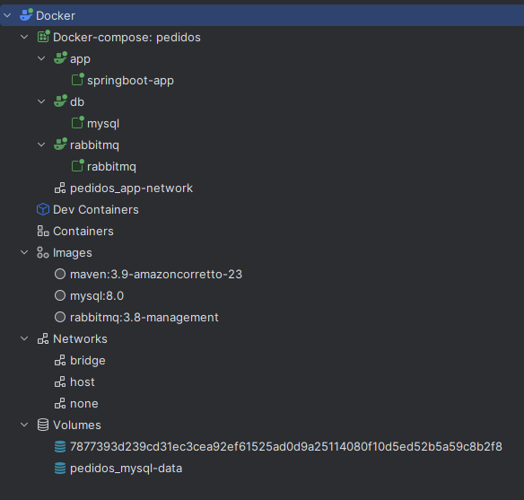
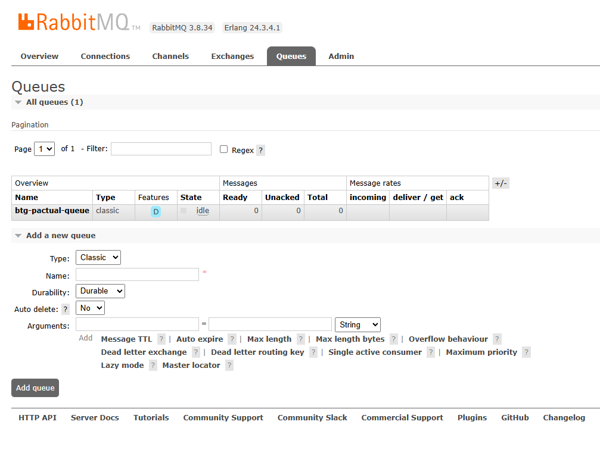
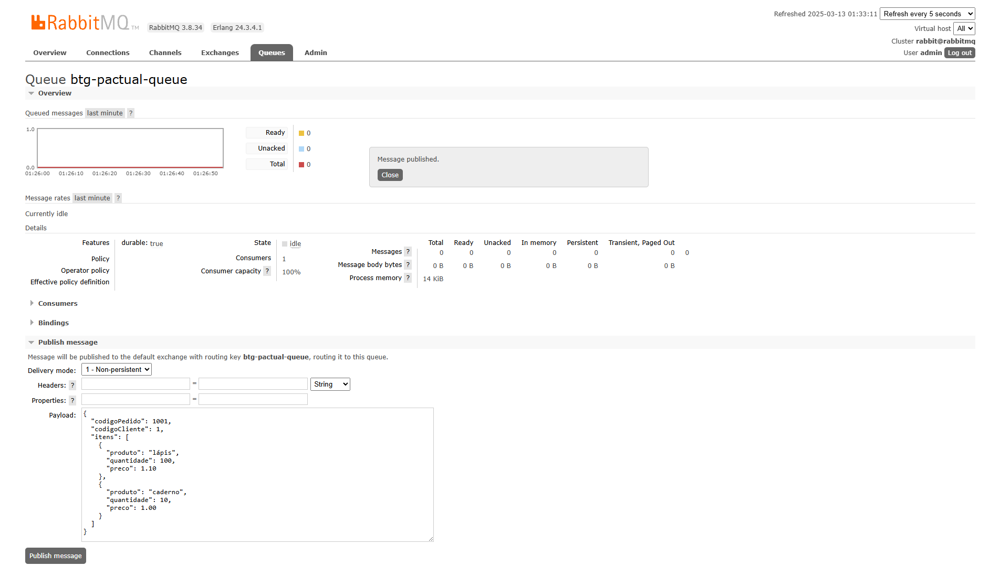
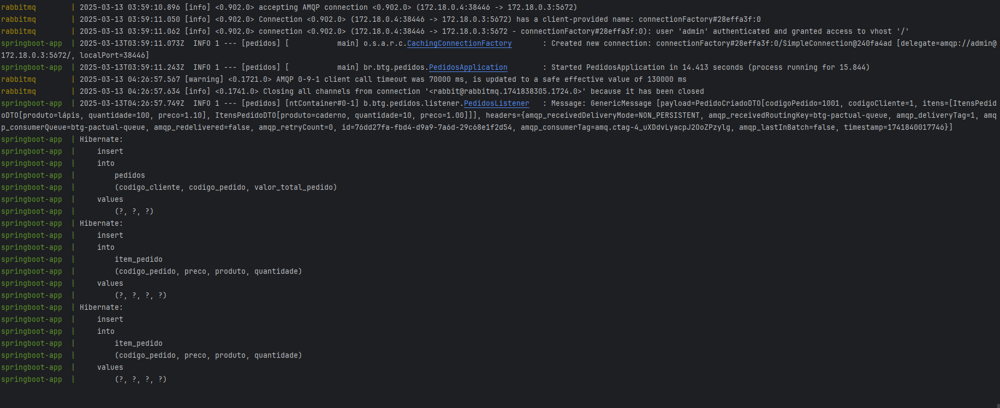
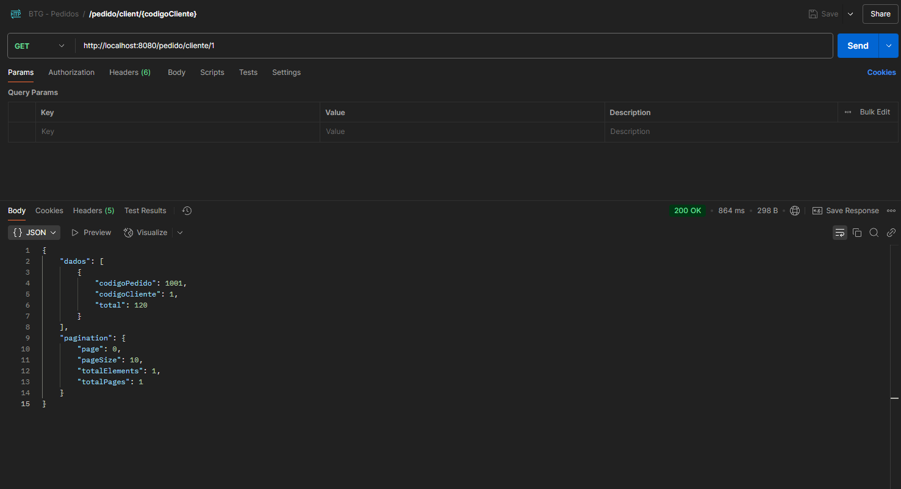
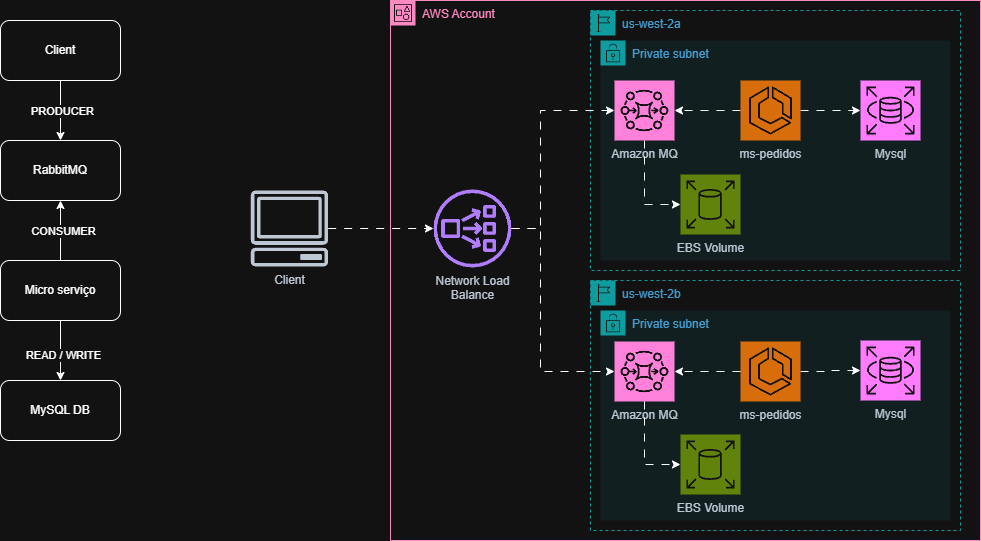

## BTG Pedidos
#### Essa aplicação foi criada para atender um Desafio para Engenheiro de Software

---
### Links de referência:

Imagem Docker Mysql - <br/>
https://hub.docker.com/_/mysql

Imagem Docker RabbitMQ - <br/>
https://hub.docker.com/_/rabbitmq

Imagem Docker Maven + Amazoncorreto - <br/>
https://hub.docker.com/_/maven

Dockercompose - <br/>
https://docs.docker.com/compose/<br/>
https://docs.docker.com/compose/how-tos/startup-order/


Spring - RabbitMQ - <br/>
https://docs.spring.io/spring-amqp/reference/amqp/receiving-messages/batch.html<br/>
https://docs.spring.io/spring-amqp/reference/amqp/message-converters.html#json-message-converter<br/>
https://docs.spring.io/spring-amqp/reference/sample-apps.html#spring-rabbit-json
---
### Técnologias utilizadas

````
Java 23
Spring Boot 3.4.3
Flyway
Lombok
Log4j
````

---
### Como rodar essa aplicação

1 - Executar o comando ``docker compose up --build``;

Container em execução:


2 - Como validar a subida do container mysql:

   Execute os comandos abaixo em sequencia: 

    docker exec -it mysql /bin/bash
    mysql -u root -p
    admin
    use btgpactual_pedidosdb;
    SHOW TABLES;

3 - Como validar a subida do container rabbitmq:

Acesse o endereço http://localhost:15672/

Username: admin

Password: admin

Acesse a aba Queues e veja que já temos uma fila criada com o nome 
**btg-pactual-queue**


  
4 - Na sequência iremos publicar uma mensagem na fila:

[payload.json](doc/payload.json)



5 - Acesse o console e veja que teremos um log do payload e do insert realizado



6 - Faça uma request para http://localhost:8080/pedido/cliente/1



---

### Diagrama de Solução e de Infra com recursos da AWS
